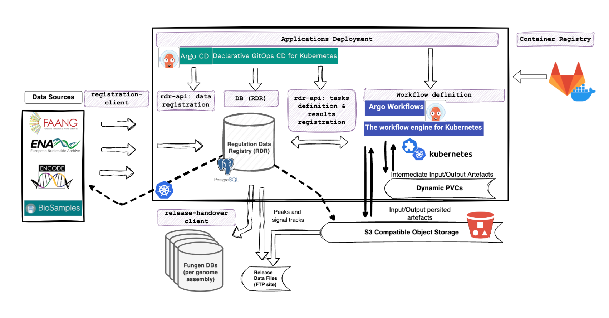

# Ensembl Regulation Workflows

Cloud-native approach to orchestrate the data processing of sequencing reads from genomic assays (ATAC-seq,
DNase-seq, and ChIP-seq) and generate peaks and signal files that summarise the enriched regions across a genome. We
use the results of our primary processing as input to identify/annotate potential regulatory regions.

## Architecture Overview

This approach involves running each step/task in our pipeline within a container. We orchestrate data processing
by declaring task dependencies
using [direct acyclic graphs (DAGs)](https://argo-workflows.readthedocs.io/en/latest/walk-through/dag/). We manage
storage allocation for our distributed
architecture with [Persistent Volume Claims (PVCs)](https://kubernetes.io/docs/concepts/storage/persistent-volumes/) and
[S3-compatible object storage](https://en.wikipedia.org/wiki/Object_storage) for persisting relevant data. To
achieve this, we leverage the abstractions and tooling provided
by [Argo Workflows (A-Wfs)](https://argo-workflows.readthedocs.io/en/latest/).

A-Wfs is a workflow engine designed from the ground up to run
in [Kubernetes (k8s)](https://kubernetes.io/docs/concepts/overview/) clusters and
extends k8s API
via [Custom Resource Definitions](https://kubernetes.io/docs/concepts/extend-kubernetes/api-extension/custom-resources/) (
e.g., [Workflow](https://argo-workflows.readthedocs.io/en/latest/workflow-concepts/#the-workflow),
[WorkflowTemplate](https://argo-workflows.readthedocs.io/en/latest/workflow-templates/)).
A-Wfs' CRDs enable the definition of complex/robust data flows in a declarative way while providing
workflow-engine-expected features (e.g., [retry strategies](https://argo-workflows.readthedocs.io/en/latest/retries/),
[conditional execution](https://argo-workflows.readthedocs.io/en/latest/walk-through/conditionals/), parallelisation and
resource allocation control). All our primary analysis data processing is designed and implemented to take advantage
of [A-Wfs cloud-native design principles](https://argo-workflows.readthedocs.io/en/latest/architecture/) and the
distributed computing architecture that k8s enables.

We use sequencing data as input to our workflows; this data comes from different external archives (ENA, FAANG portal,
ENCODE). Before kicking off processing, we structure the relevant metadata and references to the input data files in a
relational database, called [Regulation Data Registry (RDR)](https://gitlab.ebi.ac.uk/ensreg/rdr). We use this database
to structure consistently all metadata
supporting different types of assays (currently, ATAC-seq; DNase-seq; ChIP-seq) and different species (10 species so
far). We use RDR to parametrize the workflow execution, select batches of data (based on metadata dimensions and to
respond to team-wise priorities), and link results-worth-persisting to relevant metadata (e.g., peaks to assays, and
alignments to replicates).

To register the initial sequencing data and its corresponding metadata, we have implemented a client responsible for
requesting the information from each external archive web-API, and submitting it to an internally maintained rdr-API.
The rdr-API sits in the middle between the registration client and RDR, allowing the registration client to be agnostic
to the database schema. Abstracting the DB from the registration client has allowed us to evolve the DB schema more
freely and iterate faster as we increase the number of species and datasets we support. At the same time, it has allowed
us to introduce a layer for metadata validation before persisting this information in the DB and learn early from the
heterogeneity in datasets generated by different research communities.

Once we have structured the relevant information for a certain dataset in RDR, we can start submitting workflows.
The parameters that specify the workflow execution can be retrieved via JSON-formatted job definitions. We have
dedicated endpoints in rdr-API to retrieve a list of job definitions that match a filtering query. For example, we can
choose to get all alignment job definitions for all _'Mus musculus'_ _'ATAC-seq'_ assays (more specific filters
involving other metadata dimensions are available).

To automate job execution from job definitions that we get from rdr-API, we have set up entry-point workflows (main
workflows). These entry-point workflows include a task that requests from a rdr-API endpoint job definitions of a
certain type (e.g., peak-calling jobs). The call to rdr-API retrieves the list of job definitions matching the query
parameters passed by a user/operator as parameters to the entry-point workflow. With these job definitions, the workflow
fans out and starts the subsequent work necessary to fulfil each job definition. As the workflow execution progresses,
intermediate files shared between tasks are temporarily kept in dynamically allocated k8s Persistent Volume Claims,
inputs from upstream workflows are fetched from S3, and outputs worth persisting go to an S3 bucket. Once the main
workflow runs successfully, the output metadata is registered in RDR via rdr-API.

We have implemented our primary analysis workflows to follow a modular approach. This modular approach has allowed us to
group tasks with a specific concern and execution profile. For example, two of the main workflows are short-read-mapping
and a peak-calling. The short-read mapping workflow includes tasks that benefit from multithreading while having a
relatively small memory footprint that is mainly dependent on the reference genome used (common node flavors for these
tasks involve 12-16 vCPUs and 32 GB of memory). In contrast, the peak-calling
workflow includes tasks that are more memory-intensive. The memory required for a
peak-calling task can vary significantly depending on the size of the alignment files and the number of replicates
associated with an assay (32GB to 512GB; 48GB on average, based on datasets processed to date for 10 species).

We design each workflow to be general enough to be used for different species and assays. To reduce the
storage footprint, we make it impossible for intermediate files to outlive the life cycle of their workflow. By the same
idea, we fetch the primary sequencing data from their external archive on-demand and as part of the workflow
tasks.

We have also designed our workflows, the components that directly support them and depend on
them to decouple Ensembl Regulation data processing operations from the Ensembl Release cycle. This includes making sure
RDR is agnostic to the Ensembl release cycle. To integrate results into the Ensembl-wide release process, once we
have a set of quality-checked results, we label them as ready to handover. We have a
dedicated application that allows us to export the relevant metadata to the Ensembl-release Compatible DBs (one per
species), prepare relevant results, and copy these results to Ensembl public facing data directories (FTP site).

To manage the deployment of the necessary components in k8s, we use [ArgoCD](https://argo-cd.readthedocs.io/en/stable/).
ArgoCD helps to declaratively define the
desired state of the k8s cluster and the applications running in it. We have a dedicated repository to keep track of
configuration files. To successfully and efficiently run the more critical tasks in our workflows, it is
necessary to modify Argo Workflows default configuration. This is to enable long-running tasks that take multiple hours
or days to complete and handle large files (> 10GB).

The next sections will describe in more detail the logic involved in the main workflows, implementation details, and
design patterns we have found useful when orchestrating the processing of our primary data.

For more details about the components that integrate with our workflows, please refer to the documentation in their
respective repositories:

- [workflows](https://gitlab.ebi.ac.uk/ensreg/workflows/workflow-templates) (You are here; README in progress)
- [workflow-containers](https://gitlab.ebi.ac.uk/ensreg/workflows/container-images) (Update of image definitions:
  pending)
- [RDR](https://gitlab.ebi.ac.uk/ensreg/rdr)
- [registration-client](https://gitlab.ebi.ac.uk/ensreg/regulation-registration-client)
- [rdr-api](https://gitlab.ebi.ac.uk/ensreg/regulation-pipelines) (README Out of Date; pending deletion of code/config
  that has been moved to other repositories)
- [k8s-config](https://gitlab.ebi.ac.uk/ensreg/regulation-pipelines-cd) (README, recently updated; more updates in
  progress)
- [release-handover](https://gitlab.ebi.ac.uk/ensreg/handover)

*Note: There are plans to move, rename, and change the visibility of some of these repositories.*

## Primary Analysis Workflows

### Main Workflows

These workflows are the main entry-points to the compute-intensive part of the process. Each workflow has a different
resource usage profile. Separating them allows us to scale independently and better control the resources allocated when
submitting work in batches. For example, in OpenStack, we can allocate a Kubernetes node group with the execution
profile that best fits the requirements for each workflow type.

Splitting the work in these modules allows us to iterate and deliver faster. For example, we can start
processing the data and generate alignment files from the short-read-mapping workflow while still defining the
best set of parameters for peak-calling when introducing a species/dataset.

Bellow we describe the main workflows that we have implemented so far.

#### Short-read Mapping

#### Peak-calling

#### Signal Track Generation

### Auxiliary Workflows

#### Genome Assembly Index Build

#### Assembly mask generation

####

## Design Principles

### Core concepts

### Workflow Design Patterns

#### Well-documented patterns

#### Patterns specific to our use case

