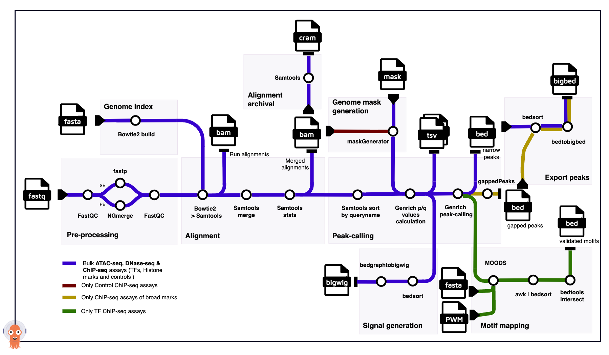

# Ensembl Regulation's primary processing workflows

Ensembl Regulation has developed a cloud-native approach to process sequencing reads (FASTQ files) from ATAC-seq, DNase-seq, and ChIP-seq assays, to produce signal (bigWig) and peaks (bigBed) that summarise enriched genome regions.

## Overview

### Entry-point workflows

- **Pre-processing and Alignment** [[Submit instructions](workflow-templates/alignment/README.md#submitting-pre-processing-and-alignment-jobs); [Data Flow](workflow-templates/alignment/README.md#data-flow)]
- **Genrich p/q values** [[Submit instructions](workflow-templates/peak-calling/README.md#submitting-genrich-pq-values-jobs); [Data Flow](workflow-templates/peak-calling/README.md#data-flow-genrich-pq-values)]
- **Peak-calling** [[Submit instructions](workflow-templates/peak-calling/README.md#submitting-peak-calling-jobs); [Data Flow](workflow-templates/peak-calling/README.md#data-flow-peak-calling)]
- **Signal generation** [[Submit instructions](workflow-templates/signal/README.md#submitting-signal-generation-jobs); [Data Flow](workflow-templates/signal/README.md#data-flow)]
- **Export peaks** [[Submit instructions](workflow-templates/export-peak/README.md#submitting-export-peaks-jobs); [Data Flow](workflow-templates/export-peak/README.md#data-flow)]
- **Motif mapping** [[Submit instructions](workflow-templates/motif-mapping/README.md#submitting-motif-mapping-jobs); [Data Flow](workflow-templates/motif-mapping/README.md#data-flow)]

#### Auxiliary Workflows

- Genome index build
- Genome mask generation
- Alignment archival

Each workflow has a distinct resource usage profile. Separating them in this way allows us to scale independently and manage resource allocation more effectively when submitting work in batches. For example, in OpenStack, we can assign a Kubernetes node group with an execution profile that best suits each workflow type.

Dividing the work into these modules enables us to iterate and deliver more quickly. For instance, we can begin with the generation alignment files while still refining and iterating to identify the best set of parameters for peak-calling when introducing a new species or dataset.

## Architecture Overview

This approach involves running each step/task in our pipeline within a container. We orchestrate data processing by declaring task dependencies
using [direct acyclic graphs (DAGs)](https://argo-workflows.readthedocs.io/en/latest/walk-through/dag/). We manage storage allocation for our distributed architecture with [Persistent Volume Claims (PVCs)](https://kubernetes.io/docs/concepts/storage/persistent-volumes/) and [S3-compatible object storage](https://en.wikipedia.org/wiki/Object_storage) for persisting relevant data. To achieve this, we leverage the abstractions and tooling provided
by [Argo Workflows (A-Wfs)](https://argo-workflows.readthedocs.io/en/latest/).

A-Wfs is a workflow engine designed from the ground up to run in [Kubernetes (k8s)](https://kubernetes.io/docs/concepts/overview/) clusters and extends k8s API via [Custom Resource Definitions](https://kubernetes.io/docs/concepts/extend-kubernetes/api-extension/custom-resources/) (e.g., [Workflow](https://argo-workflows.readthedocs.io/en/latest/workflow-concepts/#the-workflow), [WorkflowTemplate](https://argo-workflows.readthedocs.io/en/latest/workflow-templates/)). A-Wfs' CRDs enable the definition of complex/robust data flows in a declarative way while providing workflow-engine-expected features (e.g., [retry strategies](https://argo-workflows.readthedocs.io/en/latest/retries/), [conditional execution](https://argo-workflows.readthedocs.io/en/latest/walk-through/conditionals/), parallelisation, and resource allocation control). All our primary analysis data processing is designed and implemented to take advantage of [A-Wfs cloud-native design principles](https://argo-workflows.readthedocs.io/en/latest/architecture/) and the distributed computing architecture that k8s enables.

When defining our workflows we follow a modular approach. For example, two of the main workflows are Pre-processing & Alignment and Peak-calling. The Pre-processing & Alignment workflow includes tasks that benefit from multithreading while having a relatively small memory footprint that is mainly dependent on the reference genome used (common node flavors for these tasks involve 12-16 vCPUs and 32 GB of memory). In contrast, the Peak-calling workflow includes tasks that are more memory-intensive. The memory required for a peak-calling task can vary significantly depending on the size of the alignment files and the number of replicates associated with an assay (32GB to 512GB; 48GB on average, based on datasets processed to date for 10 species).

To reduce the storage footprint, we make it impossible for intermediate files to outlive the life cycle of their workflow. Following the same principle, we fetch the primary sequencing data from their external archive on-demand and as part of the workflow tasks.
