# Alignment workflow


## Submitting the workflow

To submit the workflow, use the following command:

```
argo submit \
--namespace argo \
--serviceaccount ensreg \
--from workflowtemplate/get-alignment-tasks-v-0.2.2
--parameter-file <JSON or YAML file with parameters>
```

Parameter file example (YAML):
```yaml
species_name: "Bos taurus"
experiment_type: "atac_seq"
skip: "0"
limit: "20"
```


- `assembly_ensembl_name`: 
- `experiment_type`
- `species_name`
- `epigenome_name_contains`
- `experiment_name_contains`
- `target_type`
- `epigenome_group_id`
- `skip`
- `limit`
- `overwrite-results`
- `exclude_tasks_with_registered_results`
- `group_by_run_type`

```mermaid
graph TD

    %% Entry Point with Parameters
    subgraph submitter["Alignment tasks Submitter"]
        INPUT[/"Parameters:<br/>• assembly accession<br/>• experiment type<br/>• species name<br/>• epigenome_name<br/>• skip/limit"/] -->|"Filter Criteria"| A["get-alignment-tasks"]
        
        %% Entry Point
        A -->|"Query Parameters"| B[get-rfs-alignment-tasks-url]
        B -->|"API URL"| C[execute-get-rfs-alignment-tasks]
        C ==>|"RFS Task List + Count"| D[submit-rfs-alignment-tasks]
    end
    
    %% RFS Alignment Level
    subgraph "RFS Alignment Tasks"
        D -->|"Task Index"| E["get-rfs-alignment-task-payload-by-index"]
        E ==>|"Task Payload"| F[submit-rfs-alignment]
    end
    
    %% Main RFS Alignment Pipeline
    subgraph "Read File Set Alignment"
        F -->|"Task parameters"| G[compute-rfs-alignment-task-marker-name]
        G -->|"Task Marker S3 Key"| H[check-if-task-marker-exists]
        F -->|"Output BAM Key"| I[check-if-merged-bam-already-in-s3-bucket]
        H -->|"Marker Exists (boolean)"| J[check-work-avoidance-consistency]
        I -->|"Output Exists (boolean)"| J
        
        J -->|"Run Payload JSON"| K[get-run-alignments-payload-info]
        K ==>|"Number of Runs + Run Array"| L[execute-runs-alignment]
        
        %% Resource Management
        L -->|"Total File Size (bytes)"| M[get-rfs-alignment-pvc-size]
        M -->|"PVC Size (Gi)"| N[create-rfs-alignment-pvc]
        N -->|"PVC Name"| O[copy-run-alignments-to-rfs-pvc]
        O -->|"BAM File Count"| P[validate-number-of-alignments-to-merge]
        
        %% Merge and Process
        P -->|"Multiple Run BAM Files"| Q["samtools merge (v1.15.1)"]
        Q -->|"Merged BAM File"| R[merged-alignment-from-pvc-to-s3-object]
        R -->|"BAM S3 Object"| S["samtools stats (v1.15.1)"]
        S -->|"Statistics TXT File"| T[execute-compute-file-metadata]
        T -->|"File Size + MD5sum"| U[execute-post-rfs-alignment]
        U -->|"Success Status"| V[update-rfs-alignment-task-marker]
        T -->|"Completion Signal"| W[delete-run-alignment-pvc]
    end
    
    %% Individual Run Alignment Processing
    subgraph "Run Alignment Processing"
        L ==>|"Run Index"| X[get-wf-task-payload-by-index]
        X -->|"Run Payload"| Y[submit-run-alignment]
        
        %% PE vs SE Decision Point
        Y ==>|"Sequence Type"| Z{Paired-end or Single-end?}
        
        %% Paired-End Branch
        Z ==>|"PE Payload"| AA[execute-pe-alignment]
        subgraph "PE Alignment - run-alignment-pe"
            AA -->|"Task Payload"| BB[compute-run-alignment-task-marker-name]
            BB -->|"Marker Name"| CC[check-if-task-marker-exists]
            AA -->|"Output Key"| DD[check-if-run-alignment-already-in-s3-bucket]
            CC -->|"Marker Status"| EE[check-work-avoidance-consistency]
            DD -->|"File Status"| EE
            
            EE -->|"File Size"| FF[get-run-alignment-pvc-size]
            FF -->|"PVC Size"| GG[create-run-alignment-pvc]
            GG -->|"PVC Name"| HH[load-read-files-to-pvc]
            
            %% PE Processing Steps
            HH ==>|"FASTQ.GZ files"| II["FastQC (v0.11.9)"]
            II -->|"HTML/ZIP reports"| JJ["NGmerge (v0.3)"]
            JJ ==>|"Adapter-trimmed FASTQ.GZ"| KK[clean-up-original-rf-from-pvc]
            KK -->|"Cleaned Files"| LL["FastQC (v0.11.9)"]
            LL -->|"HTML/ZIP reports"| MM["Bowtie2 (v2.4.5) + Samtools (v1.15.1)"]
            MM ==>|"Sorted BAM"| NN[update-run-alignment-task-marker]
            MM -->|"PVC Name"| OO[delete-run-alignment-pvc]
        end
        
        %% Single-End Branch
        Z ==>|"SE Payload"| PP[execute-se-alignment]
        subgraph "SE Alignment - run-alignment-se"
            PP -->|"Task Payload"| QQ[compute-run-alignment-task-marker-name]
            QQ -->|"Marker Name"| RR[check-if-task-marker-exists]
            PP -->|"Output Key"| SS[check-if-run-alignment-already-in-s3-bucket]
            RR -->|"Marker Status"| TT[check-work-avoidance-consistency]
            SS -->|"File Status"| TT
            
            TT -->|"File Size"| UU[get-run-alignment-pvc-size]
            UU -->|"PVC Size"| VV[create-run-alignment-pvc]
            VV -->|"PVC Name"| WW[load-read-file-to-pvc]
            
            %% SE Processing Steps
            WW ==>|"FASTQ.GZ file"| XX["FastQC (v0.11.9)"]
            XX -->|"HTML/ZIP reports"| YY["fastp (v0.23.2)"]
            YY ==>|"Quality-filtered FASTQ.GZ"| ZZ[clean-up-original-rf-from-pvc]
            ZZ -->|"Cleaned Files"| AAA["FastQC (v0.11.9)"]
            AAA -->|"HTML/ZIP reports"| BBB["Bowtie2 (v2.4.5) + Samtools (v1.15.1)"]
            BBB ==>|"Sorted BAM"| CCC[update-run-alignment-task-marker]
            BBB -->|"PVC Name"| DDD[delete-run-alignment-pvc]
        end
    end
    
    %% Styling
    classDef genomicTool fill:#4f46e5,color:#ffffff,stroke:#3730a3,stroke-width:2px  %% Indigo
    classDef decision fill:#fef3c7,color:#92400e,stroke:#f59e0b,stroke-width:2px     %% Warm Amber
    classDef workAvoidance fill:#e5e7eb,color:#111827,stroke:#6b7280,stroke-width:1px %% Neutral Gray
    classDef storage fill:#fbcfe8,color:#831843,stroke:#db2777,stroke-width:1px       %% Rose
    classDef inputParams fill:#bae6fd,color:#0c4a6e,stroke:#0284c7,stroke-width:2px   %% Sky Blue    
    
    class INPUT inputParams
    class Q,S,II,JJ,LL,MM,XX,YY,AAA,BBB genomicTool
    class Z decision
    class G,H,I,J,BB,CC,DD,EE,QQ,RR,SS,TT workAvoidance
    class M,N,O,P,R,T,W,FF,GG,HH,UU,VV,WW,KK,ZZ,NN,OO,CCC,DDD storage
    
    %% Hyperlinks to workflow templates
    click A "https://gitlab.ebi.ac.uk/ensreg/workflows/workflow-templates/-/blob/main/manifests/alignment/get-alignment-tasks.yaml" "Main alignment tasks workflow" _top
    click F "https://gitlab.ebi.ac.uk/ensreg/workflows/workflow-templates/-/blob/main/manifests/alignment/rfs-alignment.yaml" "RFS alignment pipeline" _top
    click AA "https://gitlab.ebi.ac.uk/ensreg/workflows/workflow-templates/-/blob/main/manifests/alignment/run-alignment-pe.yaml" "Paired-end alignment workflow" _top
    click PP "https://gitlab.ebi.ac.uk/ensreg/workflows/workflow-templates/-/blob/main/manifests/alignment/run-alignment-se.yaml" "Single-end alignment workflow" _top
    click MM "https://gitlab.ebi.ac.uk/ensreg/workflows/workflow-templates/-/blob/main/manifests//bowtie2/bowtie2-pe-cmd-pvc-callable-v-0.1.yaml" "Bowtie2 PE alignment template" _top
    click BBB "https://gitlab.ebi.ac.uk/ensreg/workflows/workflow-templates/-/blob/main/manifests/bowtie2/bowtie2-se-cmd-pvc-callable-v-0.1.yaml" "Bowtie2 SE alignment template" _top
    click II "https://gitlab.ebi.ac.uk/ensreg/workflows/workflow-templates/-/blob/main/manifests/fastqc/fastqc-pe-cmd-pvc-callable-v-0.1.yaml" "FastQC PE template" _top
    click LL "https://gitlab.ebi.ac.uk/ensreg/workflows/workflow-templates/-/blob/main/manifests/fastqc/fastqc-pe-cmd-pvc-callable-v-0.1.yaml" "FastQC PE template" _top
    click XX "https://gitlab.ebi.ac.uk/ensreg/workflows/workflow-templates/-/blob/main/manifests/fastqc/fastqc-se-cmd-pvc-callable-v-0.1.yaml" "FastQC SE template" _top
    click AAA "https://gitlab.ebi.ac.uk/ensreg/workflows/workflow-templates/-/blob/main/manifests/fastqc/fastqc-se-cmd-pvc-callable-v-0.1.yaml" "FastQC SE template" _top
    click JJ "https://gitlab.ebi.ac.uk/ensreg/workflows/workflow-templates/-/blob/main/manifests/ngmerge/ngmerge-cmd-pvc-callable-v-0.1.yaml" "NGmerge adapter removal template" _top
    click YY "https://gitlab.ebi.ac.uk/ensreg/workflows/workflow-templates/-/blob/main/manifests/fastp/fastp-se-cmd-pvc-callable-v-0.1.yaml" "fastp quality control template" _top
```



