# Export peaks workflow

## Submitting Export peaks jobs

To submit the workflow, use the following command:

```
argo submit \
--namespace argo \
--serviceaccount ensreg \
--from workflowtemplate/export-peak-tasks-v-0.1.1
--parameter-file <YAML or JSON file with parameters>
```

### Parameter file example (YAML):
```yaml
species_name: "Bos taurus"
experiment_type: "atac_seq"
skip: 0
limit: 20
```

### Available parameters

- *species_name*: `str | null`
- *assembly_ensembl_name*: `str | null`
- *experiment_type*: `(atac_seq | dnase_seq | chip_seq) | null`
- *target_type*: `(histone | tf) | null`
- *epigenome_group_id*: `UUID | null`
- *epigenome_name_contains*: `str | null`
- *experiment_name_contains*: `str | null`
- *target_name_contains*: `str | null`
- *histone_mark_type*: `broad | narrow`
- *output_prefix_label*: `str | null`
- *skip*: `int` = 0
- *limit*: `int` = 100


## Data flow

```mermaid
graph TD
    %% Entry Point
    subgraph submitter["Export Peak Tasks Submitter"]
        INPUT[/"Parameters:<br/>• species/assembly<br/>• experiment filters<br/>• epigenome filters<br/>• histone mark type<br/>• skip/limit"/]
        INPUT -->|"Filter Criteria"| A["get-export-peak-tasks"]
        A -->|"Query Parameters"| B[compute-get-export-peak-tasks-url]
        B -->|"API URL"| C[submit-get-request-from-reg-pipelines-api]
        C ==>|"Export Peak Task List"| D[submit-export-peak-tasks]
    end
    
    %% Task Processing
    D -->|"Task Payload"| E[submit-bed-to-bigbed-dag]
    
    %% Work Avoidance
    E -->|"Task Payload"| F[compute-export-peak-task-marker-name]
    F -->|"Marker S3 Key"| G[check-if-task-marker-exists]
    E -->|"Output S3 Key"| H[check-if-bigbed-file-already-in-s3-bucket]
    G -->|"Marker Status"| I[check-work-avoidance-consistency]
    H -->|"File Status"| I
    
    %% BED to BigBed Conversion
    I -->|"avoid-work == false"| J[bed-to-bigbed]
    
    subgraph bedToBigbed["BED to BigBed Conversion"]
        J -->|"BED S3 Key"| K[sort-bed]
        
        K -->|"BED File"| L["bedSort"]
        L ==>|"Sorted BED"| M[convert-bed-to-bigbed]
        
        M -->|"bed-type + chrom.sizes"| N{BED Type?}
        N ==>|"narrow"| O["bedToBigBed<br/>-type=bed6+4<br/>-as=bigNarrowPeak.as"]
        N ==>|"gapped"| P["bedToBigBed<br/>-type=bed12+3<br/>-tab"]
        
        O ==>|"BigBed File"| Q[save bigbed to S3]
        P ==>|"BigBed File"| Q
    end
    
    %% Post-Processing
    Q -->|"BigBed S3 Key"| R[execute-compute-bigbed-file-metadata]
    R -->|"File Size + MD5"| S[execute-post-bigbed-file]
    
    %% Task Marker Update
    Q -->|"Success"| T[update-export-peak-task-marker]
    
    %% Styling
    classDef genomicTool fill:#4f46e5,color:#ffffff,stroke:#3730a3,stroke-width:2px
    classDef decision fill:#fef3c7,color:#92400e,stroke:#f59e0b,stroke-width:2px
    classDef workAvoidance fill:#e5e7eb,color:#111827,stroke:#6b7280,stroke-width:1px
    classDef storage fill:#fbcfe8,color:#831843,stroke:#db2777,stroke-width:1px
    classDef inputParams fill:#bae6fd,color:#0c4a6e,stroke:#0284c7,stroke-width:2px
    
    class INPUT inputParams
    class L,O,P genomicTool
    class N decision
    class F,G,H,I workAvoidance
    class K,M,Q,R,S,T storage
```

