# Motif mapping workflow

## Submitting Motif mapping jobs

To submit the workflow, use the following command:

```
argo submit \
--namespace argo \
--serviceaccount ensreg \
--from workflowtemplate/get-motif-mapping-tasks-v-0.1.0
--parameter-file <JSON or YAML file with parameters>
```

Parameter file example (YAML):
```yaml
species_name: "Bos taurus"
experiment_type: "atac_seq"
skip: "0"
limit: "20"
```

## Data flow

```mermaid
graph TD
    %% Entry Point
    subgraph submitter["Motif Mapping Tasks Submitter"]
        INPUT[/"Parameters:<br/>• species/assembly<br/>• epigenome filters<br/>• target filters<br/>• pval threshold<br/>• skip/limit"/]
        INPUT -->|"Filter Criteria"| A["get-motif-mapping-tasks"]
        A -->|"Query Parameters"| B[compute-get-motif-mapping-tasks-url]
        B -->|"API URL"| C[submit-get-request-from-reg-pipelines-api]
        C ==>|"Task List + Count"| D[submit-motif-mapping-tasks]
    end
    
    %% Task Processing
    D -->|"Task Index"| E[submit-get-wf-task-payload-by-index]
    E ==>|"Task Payload"| F[submit-motif-mapping-by-target]
    
    %% Work Avoidance
    F -->|"Task Payload"| G[compute-signal-task-marker-name]
    G -->|"Marker S3 Key"| H[check-if-task-marker-exists]
    F -->|"Output S3 Key"| I[check-if-bigwig-file-already-in-s3-bucket]
    H -->|"Marker Status"| J[check-work-avoidance-consistency]
    I -->|"File Status"| J
    
    %% PVC Setup
    J -->|"avoid-work == false"| K[get-motif-mapping-pvc-size]
    K -->|"PVC Size"| L[create-motif-mapping-pvc]
    
    %% Parallel File Loading
    L -->|"PVC Name"| M[copy-genome-file-from-s3-to-pvc]
    L -->|"PVC Name"| N[copy-bms-file-from-s3-to-pvc]
    
    %% Genome Processing
    M -->|"Genome TGZ"| O[unzip-genome-file]
    
    %% BM Processing
    N -->|"BMs JSON"| P[filter-bms-by-target]
    
    subgraph bmFiltering["Binding Matrix Filtering"]
        P -->|"Extract PFMs for target"| Q{Target BMs<br/>Found?}
        Q ==>|"True"| R["Write PFM files<br/>(one per motif)"]
        Q ==>|"False"| S[SKIP_WORKFLOW]
    end
    
    %% MOODS Execution
    O -->|"Genome FASTA"| T[run-moods]
    R -->|"PFM Files"| T
    
    subgraph moodsExecution["MOODS Motif Scanning"]
        T -->|"moods-dna.py"| U["MOODS Scan<br/>-m *.pfm<br/>-s genome.fa<br/>-p pval threshold"]
        U ==>|"CSV Output"| V[Target motif matches]
    end
    
    %% Cleanup Phase 1
    V -->|"Complete"| W[remove-bms-file-from-pvc]
    V -->|"Complete"| X[remove-compressed-genome-file-from-pvc]
    V -->|"Complete"| Y[remove-genome-file-from-pvc]
    
    %% Convert MOODS Output
    W --> Z[convert-moods-output-to-sorted-bed]
    X --> Z
    Y --> Z
    
    subgraph moodsConversion["MOODS Output Conversion"]
        Z -->|"CSV to BED"| AA["awk processing<br/>(extract coordinates)"]
        AA -->|"Unsorted BED"| AB["bedSort"]
        AB ==>|"Sorted BED"| AC[moods.sorted.bed]
    end
    
    %% Cleanup Phase 2
    AC -->|"Complete"| AD[remove-moods-raw-output-file-from-pvc]
    AC -->|"Complete"| AE[remove-moods-bed-output-file-from-pvc]
    
    %% Peak Processing
    AD --> AF[copy-peaks-from-s3-dag]
    AE --> AF
    
    subgraph peakProcessing["Peak Files Processing"]
        AF -->|"Per Experiment"| AG[copy-peaks-file-from-s3-to-pvc]
        AG ==>|"All Peak Files"| AH["merge-peaks-files<br/>(cat + bedtools sort + bedtools merge)"]
        AH ==>|"Merged Peaks BED"| AK[peaks-TARGET.merged.sorted.bed]
    end
    
    %% Cleanup Phase 3
    AK -->|"Complete"| AL[remove-peaks-from-pvc]
    
    %% Intersection
    AL -->|"Cleanup done"| AM[run-bedtools-intersect]
    AC -->|"MOODS BED"| AM
    AK -->|"Merged Peaks BED"| AM
    
    subgraph intersection["Motif-Peak Intersection"]
        AM -->|"bedtools intersect"| AN["bedtools intersect<br/>-f 1 -wa -sorted"]
        AN ==>|"Validated Motifs BED"| AO[save to S3]
    end
    
    %% Finalization
    AO -->|"Success"| AP[update-signal-task-marker]
    AO -->|"PVC Name"| AQ[delete-motif-mapping-pvc]
    S -->|"No work needed"| AQ
    
    %% Styling
    classDef genomicTool fill:#4f46e5,color:#ffffff,stroke:#3730a3,stroke-width:2px
    classDef decision fill:#fef3c7,color:#92400e,stroke:#f59e0b,stroke-width:2px
    classDef workAvoidance fill:#e5e7eb,color:#111827,stroke:#6b7280,stroke-width:1px
    classDef storage fill:#fbcfe8,color:#831843,stroke:#db2777,stroke-width:1px
    classDef inputParams fill:#bae6fd,color:#0c4a6e,stroke:#0284c7,stroke-width:2px
    classDef cleanup fill:#fecaca,color:#7f1d1d,stroke:#dc2626,stroke-width:1px
    classDef skipState fill:#d1fae5,color:#065f46,stroke:#059669,stroke-width:2px
    
    class INPUT inputParams
    class U,AA,AB,AI,AJ,AH,AN genomicTool
    class Q decision
    class G,H,I,J workAvoidance
    class K,L,M,N,O,P,R,V,AC,AG,AK,AO,AP,AQ storage
    class W,X,Y,AD,AE,AL cleanup
    class S skipState
```

