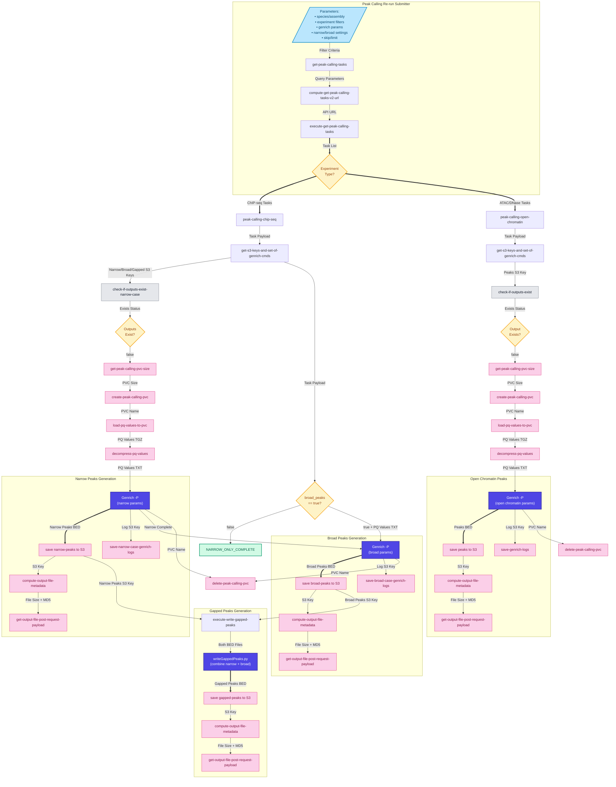

# Genrich p/q values workflow

## Submitting Genrich p/q values jobs

To submit the workflow, use the following command:

```
argo submit \
--namespace argo \
--serviceaccount ensreg \
--from workflowtemplate/genrich-tasks-v-0.1.0
--parameter-file <YAML or JSON file with parameters>
```

### Parameter file example (YAML):
```yaml
species_name: "Bos taurus"
experiment_type: "atac_seq"
output_prefix_label: "r114"
masked-regions-s3-key: "masked-regions/Bos_taurus/ARS-UCD1.3/bos_taurus_core_111_13_repeats_r113.bed"
skip: 0
limit: 20
```

### Available parameters:
- *species_name*: `str | null`
- *assembly_ensembl_name*: `str | null`
- *experiment_type*: `(atac_seq | dnase_seq | chip_seq) | null`
- *target_type*: `(histone | tf) | null`
- *epigenome_group_id*: `UUID | null`
- *epigenome_name_contains*: `str | null`
- *experiment_name_contains*: `str | null`
- *target_name_contains*: `str | null`
- *histone_mark_type*: `broad | narrow`
- *min_replicate_count*: `int | null` 
- *max_replicate_count*: `int | null`
- *exclude_tasks_missing_control*: `bool` = false
- *exclude_controls_from_tasks*: `bool` = false
- *output_prefix_label*: `str | null`
- *skip*: `int` = 0
- *limit*: `int` = 100


## Data Flow (Genrich p/q values)

```mermaid
graph TD
    %% Entry Point
    subgraph submitter["Peak Calling Tasks Submitter"]
        INPUT[/"Parameters:<br/>• species/assembly<br/>• experiment type<br/>• target type<br/>• epigenome filters<br/>• chipmentation flag<br/>• masked regions<br/>• skip/limit"/] -->|"Filter Criteria"| A["get-genrich-tasks"]
        A -->|"Query Parameters"| B[compute-get-genrich-values-tasks-url]
        B -->|"API URL"| C[execute-get-genrich-values-tasks]
        C ==>|"Peak Calling Task List"| D[submit-genrich-values-tasks]
    end

    %% Peak Calling Task Level
    subgraph "Peak Calling Task Processing"
        D -->|"Task Payload"| E[compute-peak-calling-task-marker-name]
        E -->|"Marker S3 Key"| F[check-if-task-marker-exists]
        D -->|"Output Keys"| G[check-if-pq-values-and-pileups-already-in-s3-bucket]
        F -->|"Marker Status"| H[check-work-avoidance-consistency]
        G -->|"Files Status"| H

        %% Parallel Signal and Control Processing
        H -->|"Proceed"| I[execute-signals-samtools-sort-tasks]
        H -->|"Check Controls"| J{Controls Present?}

        J ==>|"No"| K[get-genrich-input-filenames-formatted-no-controls]
        J ==>|"Yes"| L[execute-controls-samtools-sort-tasks]

        L -->|"Control Info"| M[get-same-run-type-controls]
    end

    %% Signals Samtools Sort - Expanded
    subgraph "Signal Alignment Sorting"
        I ==>|"Per Signal Alignment"| N[get-signal-pvc-size]
        N -->|"PVC Size"| O[create-signal-sort-pvc]
        O -->|"PVC Name"| P["samtools sort -n (v1.15.1)"]
        P ==>|"Query-name Sorted BAM"| Q[sorted signal BAM in PVC]
    end

    %% Controls Samtools Sort - Expanded
    subgraph "Control Alignment Sorting"
        L ==>|"Per Control Alignment"| R[get-control-pvc-size]
        R -->|"PVC Size"| S[create-control-sort-pvc]
        S -->|"PVC Name"| T["samtools sort -n (v1.15.1)"]
        T ==>|"Query-name Sorted BAM"| U[sorted control BAM in PVC]
    end

    %% Control Merge Decision and Execution
    M -->|"Analysis"| V{Merge Controls<br/>Needed?}
    V ==>|"No"| W[get-genrich-input-filenames-formatted]
    V ==>|"Yes"| X[get-genrich-input-filenames-formatted-merged-controls]

    %% Peak Calling PVC Creation and Consolidation
    Q -->|"All Signals Sorted"| Y[get-peak-calling-pvc-size]
    U -->|"All Controls Sorted"| Y
    K -->|"Ready"| Y

    Y -->|"Combined Size"| Z[create-peak-calling-pvc]

    Z -->|"Destination PVC"| AA[copy-from-signals-pvcs-to-peak-calling-pvc]
    Z -->|"Destination PVC"| AB[copy-from-controls-pvcs-to-peak-calling-pvc]

    AA -->|"Signals Copied"| AC[delete-signals-samtools-sort-tasks-pvcs]
    AB -->|"Controls Copied"| AD[delete-controls-samtools-sort-tasks-pvcs]

    %% Control Merging (if needed)
    X -->|"Merge Tasks"| AE[execute-dag-merge-controls]
    AD -->|"Controls in Peak Calling PVC"| AE

    AE -->|"Per Run Type"| AF["samtools merge -n (v1.15.1)"]
    AF ==>|"Merged Control BAM"| AG[merged controls in PVC]

    %% Genrich Output PVCs Creation
    AC -->|"Ready"| AH[get-genrich-values-pvcs-size]
    AD -->|"Ready"| AH
    AG -->|"Ready"| AH

    AH -->|"Output Size"| AI[create-pq-values-pvc]
    AH -->|"Output Size"| AJ[create-pileups-pvc]

    %% Genrich Execution - Three Paths
    K -->|"No Controls Ready"| AK[execute-genrich-no-controls]
    W -->|"With Controls Ready"| AL[execute-genrich]
    X -->|"Merged Controls Ready"| AM[execute-genrich-merged-controls]

    AI -->|"PQ Values PVC"| AK
    AJ -->|"Pileups PVC"| AK
    AI -->|"PQ Values PVC"| AL
    AJ -->|"Pileups PVC"| AL
    AI -->|"PQ Values PVC"| AM
    AJ -->|"Pileups PVC"| AM

    %% Genrich Command Execution
    subgraph "Genrich Analysis Execution"
        AK -->|"Experiment Type"| AN{ChIP-seq or<br/>ATAC/DNase?}
        AL -->|"Experiment Type"| AO{ChIP-seq or<br/>ATAC/DNase?}
        AM -->|"Experiment Type"| AP{ChIP-seq or<br/>ATAC/DNase?}

        AN ==>|"ChIP-seq"| AQ["Genrich (v0.6.1)<br/>ChIP-seq mode<br/>no controls"]
        AN ==>|"ATAC/DNase"| AR["Genrich (v0.6.1)<br/>Open chromatin mode<br/>-j flag, -D for DNase"]

        AO ==>|"ChIP-seq"| AS["Genrich (v0.6.1)<br/>ChIP-seq mode<br/>with controls"]
        AO ==>|"ATAC/DNase"| AT["Genrich (v0.6.1)<br/>Open chromatin mode<br/>-j flag, -D for DNase"]

        AP ==>|"ChIP-seq"| AU["Genrich (v0.6.1)<br/>ChIP-seq mode<br/>merged controls"]
        AP ==>|"ATAC/DNase"| AV["Genrich (v0.6.1)<br/>Open chromatin mode<br/>-j flag, -D for DNase"]

        AQ -->|"PQ Values + Pileups"| AW[Output files to PVCs]
        AR -->|"PQ Values + Pileups"| AW
        AS -->|"PQ Values + Pileups"| AW
        AT -->|"PQ Values + Pileups"| AW
        AU -->|"PQ Values + Pileups"| AW
        AV -->|"PQ Values + Pileups"| AW
    end

    %% Output Processing
    subgraph "Output Post-Processing"
        AW -->|"Per File Type"| AX[compute-output-file-metadata]
        AX -->|"Size + MD5"| AY[get-output-file-post-request-payload]
        AX -->|"TXT File"| AZ["pigz compression"]
        AZ -->|"TGZ File"| BA[save-file-to-s3]

        BA -->|"Both Files Saved"| BB[update-peak-calling-task-marker]
    end

    %% Cleanup
    AW -->|"Processing Complete"| BC[delete-peak-calling-pvc]
    BA -->|"Files Saved"| BD[delete-pq-values-pvc]
    BA -->|"Files Saved"| BE[delete-pileups-pvc]

    %% Styling
    classDef genomicTool fill:#4f46e5,color:#ffffff,stroke:#3730a3,stroke-width:2px
    classDef decision fill:#fef3c7,color:#92400e,stroke:#f59e0b,stroke-width:2px
    classDef workAvoidance fill:#e5e7eb,color:#111827,stroke:#6b7280,stroke-width:1px
    classDef storage fill:#fbcfe8,color:#831843,stroke:#db2777,stroke-width:1px
    classDef inputParams fill:#bae6fd,color:#0c4a6e,stroke:#0284c7,stroke-width:2px
    classDef pvcOps fill:#ddd6fe,color:#4c1d95,stroke:#7c3aed,stroke-width:1px

    class INPUT inputParams
    class P,T,AF,AQ,AR,AS,AT,AU,AV,AZ genomicTool
    class J,V,AN,AO,AP decision
    class E,F,G,H workAvoidance
    class N,O,Q,R,S,U,Y,Z,AA,AB,AC,AD,AH,AI,AJ,AX,AY,BA,BB,BC,BD,BE storage
    class AA,AB,AC,AD,BC,BD,BE pvcOps
```



# Peak calling workflow

## Submitting peak-calling jobs

To submit the workflow, use the following command:

```
argo submit \
--namespace argo \
--serviceaccount ensreg \
--from workflowtemplate/get-peak-calling-tasks-v-0.2.0
--parameter-file <JSON or YAML file with parameters>
```

Parameter file example (YAML):
```yaml
species_name: "Bos taurus"
assembly_ensembl_accession: "GCA_002263795.4"
experiment_type: "atac_seq"
output_prefix_label: "r114"
min_replicate_count: 2
skip: "0"
limit: "20"
genrich-params: |
  {
    "a": null,
    "q_val": 0.1,
    "p_val": null,
    "g": null
  }
```

## Data Flow (Peak-calling)
