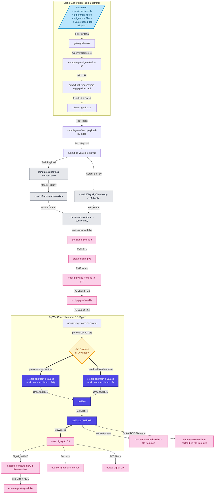

# Signal generation workflow

## Submitting Signal generation jobs

To submit the workflow, use the following command:

```
argo submit \
--namespace argo \
--serviceaccount ensreg \
--from workflowtemplate/get-signal-task-v-0.2-0
--parameter-file <JSON or YAML file with parameters>
```

Parameter file example (YAML):
```yaml
species_name: "Bos taurus"
experiment_type: "atac_seq"
skip: "0"
limit: "20"
```

## Data flow


